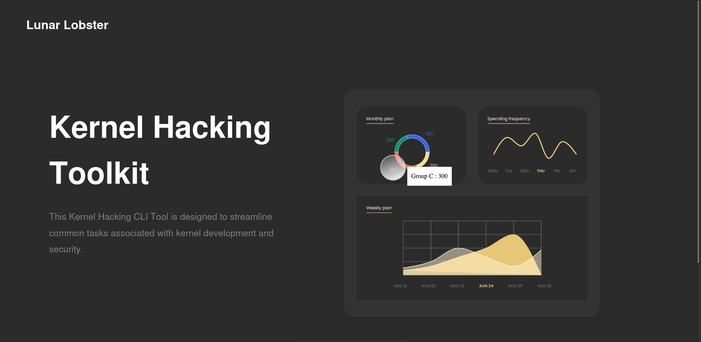

# Kernel Hacking CLI Tool

A command-line interface (CLI) tool for kernel hacking that simplifies tasks related to kernel vulnerability analysis, CVE research, and kernel compilation.

## Table of Contents
- [Introduction](#introduction)
- [Features](#features)
- [Installation](#installation)
- [Usage](#usage)
- [Contributing](#contributing)
- [License](#license)

## Introduction

This Kernel Hacking CLI Tool is designed to streamline common tasks associated with kernel development and security. Whether you are a kernel developer, a security enthusiast, or a system administrator, this tool provides valuable functionality to simplify your workflow.

## Features

### 1. Vulnerability Analyzer

The `vulnerability_analyze` function allows you to quickly check your current kernel version and identifies the top vulnerabilities for your system. It provides an at-a-glance summary of your kernel's security status.

### 2. CVE Research

With the `cve_research` function, you can conduct in-depth research into a specific CVE (Common Vulnerabilities and Exposures) number. Simply input the CVE number you wish to investigate, and the tool will retrieve detailed information about the vulnerability from reliable sources.

### 3. Kernel Compilation

Kernel compilation can be a complex and time-consuming process. The `kernel_compile` function simplifies this task by presenting you with a menu of kernel versions to choose from. Once you make your selection, the tool automates the download, compilation, and installation of the chosen kernel version.

## Installation

To use this tool, you will need to set up the required dependencies:

- Rust programming language
- [console](https://crates.io/crates/console)
- [dialoguer](https://crates.io/crates/dialoguer)

Once you have these dependencies installed, you can compile the code and run the CLI tool.

## Usage

1. Run the tool by executing the binary:
`cargo run`
2. Choose one of the available options from the menu:
- Vulnerability Analyzer
- CVE Research
- Kernel Compilation

3. Follow the prompts to utilize the chosen functionality.

## Contributing

We welcome contributions from the open-source community. If you have ideas for new features or improvements, please submit a pull request. For major changes, please open an issue to discuss your ideas.

## License

This Kernel Hacking CLI Tool is open-source software licensed under the [MIT License](LICENSE).

Happy hacking!

